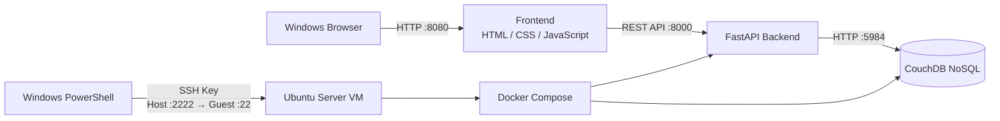

# Personal Profile Web

這是一個以前後端分離方式開發的個人簡介網站。

系統部署於 Ubuntu Server 虛擬機，使用 FastAPI 建立後端 REST API，並以 CouchDB 作為 NoSQL 資料庫。前端使用 HTML、CSS、JavaScript 製作，可顯示個人資料，並提供管理員登入與資料修改功能。

---

## 功能

- 顯示個人基本資料
- 管理員登入
- 修改個人資料
- 將修改後的資料儲存至 CouchDB
- 前端透過 REST API 與 FastAPI 後端溝通
- 使用 Docker Compose 管理後端與資料庫服務
- 使用 SSH Key Only 管理 Ubuntu Server
- 使用 UFW 防火牆限制連線
- 使用 Git / GitHub 進行版本控制

---

## 系統架構



### 資料流程

1. 使用者透過 Windows 瀏覽器開啟前端網頁。
2. JavaScript 呼叫 FastAPI REST API。
3. FastAPI 從 CouchDB 讀取個人資料。
4. API 將 JSON 資料回傳給前端。
5. 管理員登入後可以修改資料。
6. 修改後的資料透過 API 寫入 CouchDB。

---

## 使用技術

### Server

- Ubuntu Server
- VirtualBox
- SSH
- UFW

### Frontend

- HTML
- CSS
- JavaScript

### Backend

- Python
- FastAPI
- Uvicorn
- Requests

### Database

- CouchDB
- NoSQL

### Deployment

- Docker
- Docker Compose

### Version Control

- Git
- GitHub

---

## 專案目錄

```text
profile-web/
├── backend/
│   ├── app/
│   │   └── main.py
│   ├── Dockerfile
│   └── requirements.txt
│
├── frontend/
│   ├── css/
│   │   └── style.css
│   ├── js/
│   │   ├── main.js
│   │   └── admin.js
│   ├── index.html
│   └── admin.html
│
├── docker-compose.yml
├── .env.example
├── .gitignore
└── README.md
```

---

## 網頁

### 個人資料頁面

```text
http://127.0.0.1:8080/
```

顯示姓名、學校、科系與自我介紹。

### 管理員頁面

```text
http://127.0.0.1:8080/admin.html
```

管理員輸入密碼登入後，可以修改個人資料並儲存至 CouchDB。

---

## API

### 取得個人資料

```text
GET /api/profile
```

### 管理員登入

```text
POST /api/login
```

### 修改個人資料

```text
PUT /api/profile
```

修改資料需要登入後取得的 token。

---

## 環境變數

實際密碼儲存在 `.env`，此檔案已加入 `.gitignore`，不會上傳至 GitHub。

`.env.example` 僅提供環境變數名稱與範例，不包含實際密碼。

需要設定：

```text
COUCHDB_PASSWORD=your_couchdb_password
ADMIN_PASSWORD=your_admin_password
```

---

## Docker

後端 FastAPI 與 CouchDB 使用 Docker Compose 管理。

啟動：

```bash
docker compose up -d --build
```

查看容器狀態：

```bash
docker compose ps
```

停止：

```bash
docker compose down
```

---

## SSH 安全設定

伺服器使用 SSH Key Authentication。

主要設定：

```text
PubkeyAuthentication yes
PasswordAuthentication no
KbdInteractiveAuthentication no
```

因此遠端登入必須使用 SSH Private Key，不允許一般 SSH 密碼登入。

---

## UFW 防火牆

Ubuntu Server 啟用 UFW 防火牆。

主要允許：

```text
22/tcp
8080/tcp
```

SSH 使用 VirtualBox NAT Port Forwarding：

```text
Windows 127.0.0.1:2222
        ↓
Ubuntu Server :22
```

---

## 安全措施

- SSH 使用金鑰驗證
- 關閉 SSH Password Authentication
- 啟用 UFW
- `.env` 不上傳 GitHub
- SSH Private Key 不加入 Git
- CouchDB 未直接對 Windows Host 公開連接埠
- 管理員修改 API 需要登入 token
- 使用 `.gitignore` 排除敏感檔案

---

## 作者

國立臺東大學  
資訊工程學系
